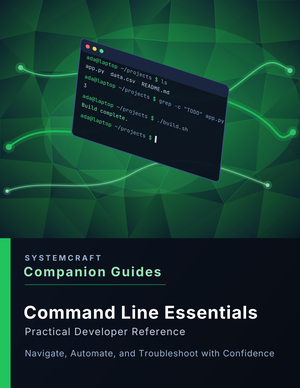

# Command Line Essentials Companion Guide

_Practical Developer Reference_

Navigate, Automate, and Troubleshoot with Confidence

A concise, practical guide for developers. Part of the SystemCraft™ Companion Guide Series.

## About this Repository



This repository is the companion to the **Command Line Essentials Companion Guide** — a practical, no-fluff reference for developers who want to move around the terminal, chain commands together, and automate small tasks with real confidence (and without accidentally deleting the wrong thing).

It's free and open: a cheat sheet, quick-reference tables, worked examples, hands-on exercises, and diagrams covering navigation, redirection and pipes, permissions and processes, environment configuration, and basic shell scripting.

## Topics Covered

- Navigating the filesystem and managing files
- Reading and searching file contents
- Redirection and pipes
- Permissions and processes
- Environment variables and shell configuration
- Scripting basics
- Quick-reference command tables, including bash → PowerShell equivalents
- Scenario-based troubleshooting
- Full command-line glossary

## Get the Full Companion Guide

| Format | Where to Buy | Price |
| ------ | ------------ | ----- |
| PDF    | [Payhip](https://payhip.com/b/xRFni) | $9.99 |

The full guide adds the material this repo doesn't cover for free: the complete 11-section walkthrough, scenario-based troubleshooting for common panic moments, and the full glossary.

## What Is In This Repo

- **`cheatsheet/`** — a free one-page terminal cheat sheet: navigation, redirection, permissions, and golden rules
- **`reference/`** — quick-reference tables: file operations, redirection symbols, process commands, and a bash-to-PowerShell translation table
- **`examples/`** — worked examples: a real log-analysis pipeline, safe file deletion habits, a small automation script, tracking down a runaway process
- **`exercises/`** — hands-on practice: navigation and file-op warmup, building a log-analysis pipeline, writing a backup script
- **`diagrams/`** — visual diagrams for how a pipeline moves data, the process lifecycle, and the safe-deletion decision flow
- **`preview/`** — a look at the full Companion Guide's cover and interior layout

## Repository Structure

```
command-line-essentials/
├── README.md
├── LICENSE.md
├── cheatsheet/
│   └── command-line-essentials-cheatsheet.md
├── reference/
│   └── quick-reference.md
├── examples/
│   ├── 01-pipes-and-redirection-in-practice.md
│   ├── 02-safe-file-operations.md
│   ├── 03-a-small-shell-script.md
│   └── 04-tracking-down-a-runaway-process.md
├── exercises/
│   ├── 01-navigation-and-file-ops-warmup/
│   ├── 02-build-a-log-analysis-pipeline/
│   └── 03-write-a-backup-script/
├── diagrams/
│   ├── pipe-and-redirect-flow.md
│   ├── process-lifecycle.md
│   └── safe-deletion-decision-flow.md
└── preview/
    ├── cover.png
    ├── cover-thumbnail.png
    └── page-spread.png
```

## The Essentials Series

| Guide                     | GitHub                                                               | Buy      |
| -------------------------- | --------------------------------------------------------------------- | -------- |
| Git & GitHub              | [Repo](https://github.com/SystemCraftPress/git-github)                | [Payhip](https://payhip.com/b/FWnfc) |
| Python Essentials         | [Repo](https://github.com/SystemCraftPress/python-essentials)         | [Payhip](https://payhip.com/b/CdpnI) |
| JavaScript Essentials     | [Repo](https://github.com/SystemCraftPress/javascript-essentials)     | [Payhip](https://payhip.com/b/4fWhP) |
| **Command Line Essentials** | **You are here**                                                       | [Payhip](https://payhip.com/b/xRFni) |
| SQL Essentials            | [Repo](https://github.com/SystemCraftPress/sql-essentials)            | [Payhip](https://payhip.com/b/kiapM) |
| VS Code Essentials        | [Repo](https://github.com/SystemCraftPress/vscode-essentials)         | [Payhip](https://payhip.com/b/mw3vu) |

## About SystemCraft™ Press

SystemCraft™ Press publishes practical, developer-focused learning resources designed to build understanding — not just memorization.

Each Companion Guide combines concise explanations, real-world examples, troubleshooting advice, quick-reference material, and printable cheat sheets to help developers become more confident with the tools they use every day.

This repository accompanies the **Command Line Essentials Companion Guide** and provides supplemental resources, examples, and updates that complement the book.

Learn more about the Companion Guides series at the links above.

## License

This repository contains proprietary documentation, branding, and educational content owned by SystemCraft™ Press.

Code examples are provided for educational use and may be used in your own software projects. The accompanying Companion Guide ebook is a commercial publication and is not included in this repository.

See the [LICENSE](LICENSE.md) file for complete terms.
