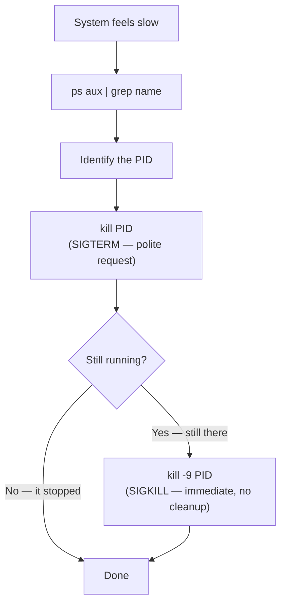

# Diagram: The Process Kill Escalation Path

The escalation from [Example 4](../examples/04-tracking-down-a-runaway-process.md) — from finding a process to actually stopping it.

`SIGTERM` gives a well-behaved process the chance to close files and exit cleanly. `SIGKILL` skips all of that — reach for it only after a plain `kill` has genuinely failed, since a process killed mid-write can leave corrupted output behind.
