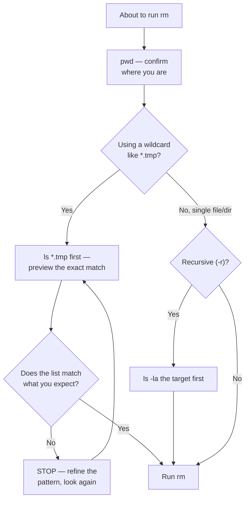

# Diagram: The Safe-Deletion Checklist

The habit from [Example 2](../examples/02-safe-file-operations.md), as a flowchart. There is no undo for `rm` — this is the checklist that makes that survivable.

The pattern underneath every branch is the same: whatever `rm` is about to receive, look at it first with a non-destructive command.
